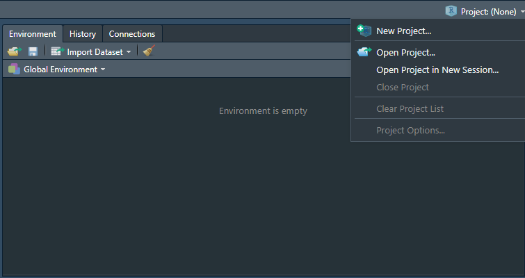
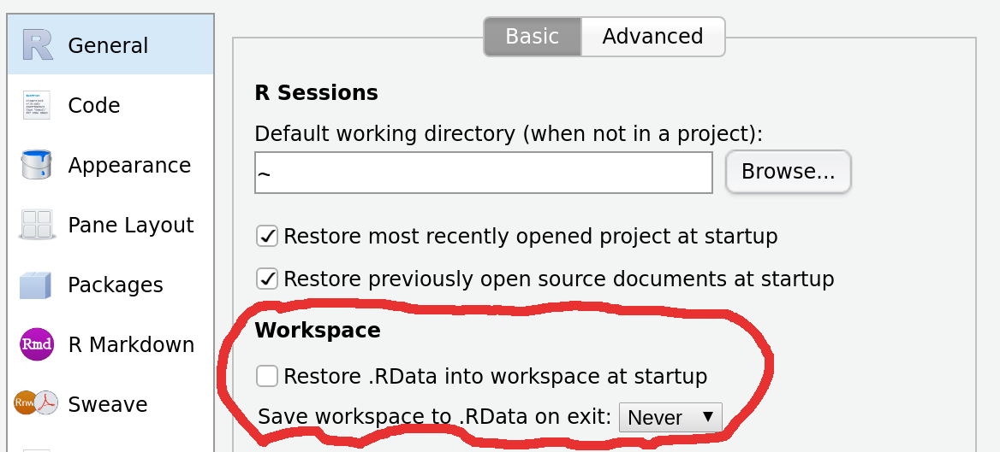

# Bien commencer

## Créer un projet sous Rstudio pour vous permettre de recencer vos travaux.

Pourquoi travailler avec les projets Rstudio plutôt que les scripts R ?

- Cela permet la portabilité : le répertoire de travail par défaut d'un projet est le répertoire où est ce projet. Si vous transmettez celui-ci à un collègue, le fait de lancer un programme ne dépend pas de l'arborescence de votre machine.

> **Fini les `setwd("chemin/qui/marche/uniquement/sur/mon/poste")` !** 

- Toujours sur la portabilité, un projet peut être utiliser avec un package comme `packrat` ou `renv` qui vont vous permettre d'internaliser au sein du projet l'ensemble des packages dont vous aurez besoin dans votre projet dans la version avec laquelle vous l'avez utilisé. Cela permet donc à votre collègue à qui vous passer votre projet de ne pas avoir à les installer dans la même version, et si vous mettez à jour votre environnement R, votre projet restera toujours avec les versions des packages avec lesquelles vous avez fait tourné votre projet à l'époque. Cela évite d'avoir à subir les effets d'une mise à jour important d'un package qui casserait votre code.

`Packrat` est intégré à Rstudio. pour activer packrat sur un projet, aller dans `Tools/Project Options->Packrat`

[En savoir plus sur Packrat](https://www.rstudio.com/resources/webinars/managing-package-dependencies-in-r-with-packrat/)

{#id .class width=500}

`renv` est plus récent que `Packrat`, il n'est pas encore intégré à Rstudio mais apporte des améliorations subsentielles par rapport à son prédécesseur. 
[En savoir plus sur renv](https://rstudio.github.io/renv/)

- Cela permet de se forcer à travailler en mode projet : on intègre à un seul endroit tous ce qui est lié à un projet : données brutes, données retravaillées, scripts, illustrations, documentations, publications... et donc y compris packages avec `packrat` ou `renv`.

- On peut travailler sur plusieurs projets en même temps, Rstudio ouvre autant de sessions que de projets dans ce cas.

- Les projets Rstudio intègrent une interface avec les outils de gestion de version `git` et `svn.` Cela veut dire que vous pouvez versionniser votre projet et l'héberger simplement comme répertoire sur des plateformes de gestion de code telle que `github` ou `gitlab.`

**Pour créer un projet : **

- Cliquez sur *Project* en haut à droite puis *New Project*.
{#id .class width=500}

- Cliquez sur *New Directory*.
{#id .class width=500}

## Désactiver les options de sauvegarde automatique de Rstudio

Votre code doit être reproductible depuis vos données en entrée vers votre résultat. Pour cela, il est fortement déconseillé de sauvegarder quoique ce soit dans le fichier `.RData` de sauvegarde par défaut. 

Pour cela, aller dans *Tools->Global Options...* et ensuite conformez vous à ceci

## Intégrer vos données

Une bonne pratique est de créer un sous répertoire `/data` pour stocker les données sur lesquelles vous aurez à travailler. 

Vous pouvez le faire de l'explorateur de fichier de votre système d'exploitation ou directement à partir de l'explorateur de fichier de RStudio.
{#id .class width=500}

Cela marche bien quand on a un seul type de données, mais en général on va avoir à travailler sur des données brutes que l'on va retravailler. Dans ce cas, vous pouvez utiliser un répertoire différent pour vos données brutes et vos données après préparation. 

Si par la suite vous souhaitez avoir des exemples de bonnes pratiques sur comment structurer vos données, vous pouvez vous référer au [chapitre data](http://r-pkgs.had.co.nz/data.html) du livre d'Hadley Wickham sur la construction de package R (tout package R étant aussi un projet !)

## Créer votre arborescence de projet

- Créer un répertoire `/src` ou vous mettrez vos scripts R.

- Créer un répertoire `/figures` ou vous mettrez vos illustrations issues de R.

## Activer les packages nécessaires

Commencer par rajouter un script dans le répertoire `/src` à votre projet qui commencera par : 

- activer l'ensemble des packages nécessaires

- charger les données dont vous aurez besoins.

## Bien structurer ses projets data

Plusieurs documents peuvent vous inspirer sur la structuration de vos projets data par la suite.

En voici quelques uns : 

- https://github.com/pavopax/new-project-template
- https://nicercode.github.io/blog/2013-04-05-projects/
- https://www.inwt-statistics.com/read-blog/a-meaningful-file-structure-for-r-projects.html
- http://projecttemplate.net/architecture.html

A partir du moment où quelques grands principes sont respectés (un répertoire pour les données brutes en lecture seule par exemple), le reste est surtout une question d'attirance plus forte pour l'une ou l'autre solution. L'important est de vous tenir ensuite à garder toujours la même structure dans vos projets afin de vous y retrouver plus simplement.
