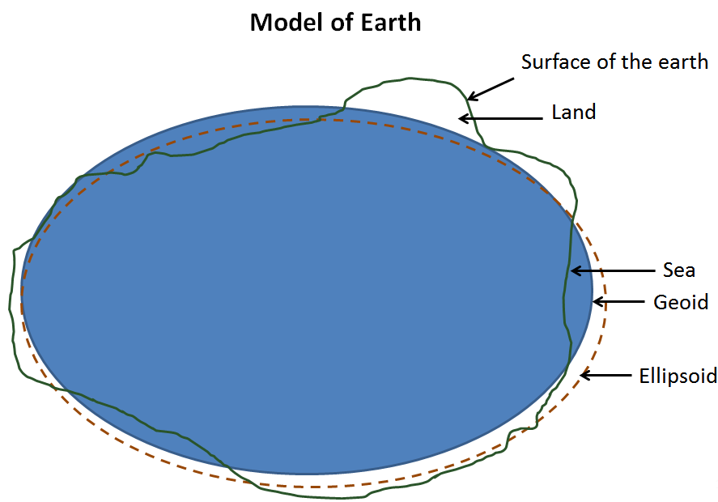

# Les Systèmes de Coordonnées de Référence

Les données spatiales vises à modéliser la terre. 
La terre est un objet dont la mesure a une longue histoire, qu'on a pensé plate, cylindrique, ronde,  ellipsoïde. Maintenant, on sait que la terre a cette forme là : 

<iframe src="https://player.vimeo.com/video/213210796" width="640" height="640" frameborder="0" allow="autoplay; fullscreen" allowfullscreen></iframe>

<a href="https://vimeo.com/213210796">THE REAL SHAPE OF PLANET EARTH - 3D Animation HD</a> from <a href="https://vimeo.com/elearnpunjab">eLearn.Punjab</a> on <a href="https://vimeo.com">Vimeo</a>.

Les systèmes de coordonnées de référence vont permettre de se repérer sur la surface de la terre.

## Le système géodésique ou datum

Pour modéliser la surface terrestre, on va définir un *géoïde*, qui est la surface théorique de la pesanteur.

Ce *géoïde* est proche d'un ellipsoïde, c'est à dire une surface obtenue en faisant tourner une ellipse sur son axe. La terre est en effet compressée :  le rayon à l'équateur est 11,5 km plus long que le rayon polaire (Maling 1992).

On va donc pouvoir approximer ce géoïde par un ellipsoïde.

Un point quelconque est repéré par rapport à l’ellipsoïde en utilisant un système de coordonnées sphériques : longitude, latitude, altitude.

Le *datum* ou *système géodésique* va correspondre aux paramètre de forme de l'ellipsoïde et de positionnement sur celle ci.

On va distinguer deux types de datum : les datum *locaux* et les datum *globaux*.

Historiquement n'existait que des datum locaux, c'est à dire qui définissait une ellipse optimale pour correspondre à une partie déterminée de la surface de la terre. Cette contrainte était liée à la façon de définir le géoïde : avant les techniques spatiales, on utilisait des mesures de triangulation à partir d'un point défini par mesure astronomique.

Depuis l'avènement des techniques spatiales, on est capable de définir un *datum global* grâce aux mesures satellitaires. Le système mondial de référence est aujourd'hui le WGS 84, associé au GPS.

Il y a donc aujourd'hui beaucoup de *datum*, un pour la plupart des pays, qui maximise la modélisation de l'ellipsoïde sur leur territoire, et des datums globaux.

## Les coordonnées

Pour se repérer sur terre, on va utiliser un système géodésique sur lequel on va se positionner avec des coordonnées. 

On distingue deux types de coordonnées :

### Coordonnées géographiques

Les systèmes de coordonnées géographiques identifient tout lieux sur la surface de la terre en utilisant deux paramètres, la longitude et la lattitude : 

- La Longitude est la localisation sur la direction Est-Ouest. Elle est définie par l'angle par rapport à un méridien.

- La Latitude définie la localisation sur la direction Nord-Sud. Elle est définie par l'angle avec l'équateur. 

<iframe width="560" height="315" src="https://www.youtube.com/embed/eSTJV40Lzro" frameborder="0" allow="accelerometer; autoplay; encrypted-media; gyroscope; picture-in-picture" allowfullscreen></iframe>

Dans un système de coordonnées géographiques, les lieux sont donc identifiés par des *angles* et non des *mètres*.

### Coordonnées en projection

Les systèmes de coordonnées projetés se basent sur une modélisation de la terre plane (donc projetée sur un plan) et un système de coordonnés cartésien pour définir un point sur ce plan à partir d'une origine, d'un axe x, d'un axe y et d'une unité de mesure (comme le mètre).

Tous les systèmes de coordonnées projetés se basent sur un système de coordonnées géographiques et sur une projection spatiale des données de l'ellipse en 3D sur un plan.

Cet exercice ne peut se faire sans distorsion. Les propriétés de la surface de la terre comme l'aire, la direction, la distance, la forme ne peuvent être toutes conservées.

En général un système de coordonnées projetés ne permet de préserver qu'une ou deux de ces propriétés. On classifie d'ailleurs ces projections selon les propriétés conservées  : 

- conformes (conservent les angles)
- équivalentes (conservent les surfaces) 
- aphylactique (peut être équidistante, c'est-à-dire conserver les distances sur les méridiens)

On distingue également les projection en fonction de leur mode de projection. Il y a trois principaux groupes de projections : 

- Conique : la terre est projetée sur un cone reposant sur une ou deux tangentes. Les distorsions sont faibles sur la ligne de tangente et augmentent ensuite avec la distance à celle-ci. C'est ainsi le type de projection le mieux adapté pour des cartes réalisées sur des latitudes médianes.

- Cylindrique : ces projections projettent la surface de la terre sur un cylindre. Souvent utilisées pour cartographier la terre entière.

- Plane : projection du globe sur une surface plane tangeante en un point ou sur une ligne. Souvent utilisée pour les régions polaires.

### Exemple de projections

#### Equal Earth

Le but de la projection [Equal-Earth](http://equal-earth.com) est de représenter la Terre avec toutes ses régions à part égale.

Equal Earth est une projection pseudo-cylindrique ressemblant à celle de Robinson qui évoque comme elle la rotondité de la Terre. Mais à la différence de cette dernière, elle préserve les surfaces.
 
- http://cartonumerique.blogspot.com/2018/11/la-projection-equal-earth.html

## Code EPSG

L'EPSG (European Petroleum Survey Group), un groupe créé en 1985, a défini une liste des systèmes de coordonnées géoréférencées et leur a associé des codes pour les identifier. Le groupe est devenu en 2005 le "Comité de topographie et de positionnement" de l'Association internationale des producteurs de pétrole et de gaz (OGP). La liste peut être trouvée sur [ce site](http://www.epsg.org/).

Un système géodésique peut recevoir plusieurs codes EPSG selon son utilisation : 2D ou 3D par exemple.
