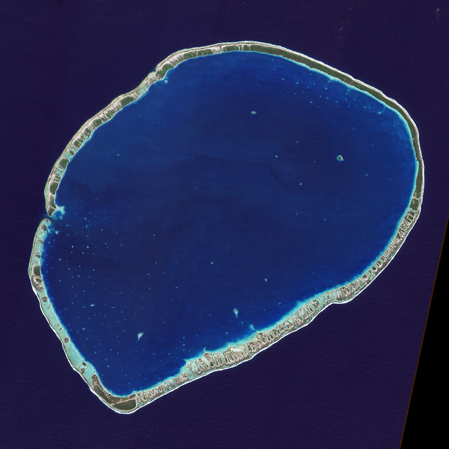

# Les opérations géométriques

Nous allons voir dans ce chapitre comment opérer des opérations géométriques sur nos vecteurs.

Dans ce chapitre, nous allons utiliser les packages suivants.

```{r}
library(sf)
library(tidyverse)
library(mapview)
library(ggplot2)
library(rmapshaper)
```

On distingue deux types d'opérations : les opérations unaires et binaires.


## Opérations unaires

### Simplification

La simplification revient comme son nom l'indique à simplifier une couche vectorielle. Le cas d'usage d'un tel procédé peut être un changement d'échelle et plus généralement le besoin de réduire la taille de stockage de notre objet (par exemple pour une publication ou une carte interactive).

Le package `sf` contient une fonction `st_simplify` qui implémente l'algorithme de Douglas-Peucker^[Douglas, David H, and Thomas K Peucker. 1973. “Algorithms for the Reduction of the Number of Points Required to Represent a Digitized Line or Its Caricature.” Cartographica: The International Journal for Geographic Information and Geovisualization 10 (2): 112–22.] de GEOS.

La fonction utilise le paramètre `dTolerance` pour controler le niveau de simplification.

```{r}
load("data/admin_express.RData")

departement_56 <- departements_geo %>%
  filter(INSEE_DEP == "56")

departement_56_simplifie <- departement_56 %>%
  st_simplify(dTolerance = 900)

departement_56_super_simplifie <- departement_56 %>%
  st_simplify(dTolerance = 2000)
```

```{r,echo=TRUE,}
p1 <- ggplot() + 
  geom_sf(data = departement_56) + 
  theme_void() + 
  theme(panel.grid = element_blank(), panel.border = element_blank())

p2 <- ggplot() + 
  geom_sf(data = departement_56_simplifie) +
  theme_void()

p3 <- ggplot() + 
  geom_sf(data = departement_56_super_simplifie) + 
  theme_void()

p1 + p2 + p3 + plot_layout(nrow = 1)
```

On peut mesurer le gain réalisé par chaque opération.

- Une simplification avec un `dTolerance` de 900 permet d'économiser `r - round(100*object.size(departement_56_simplifie)/object.size(departement_56)-100,1)` % du stockage.

- Une simplification avec un `dTolerance` de 2000 permet d'économiser `r - round(100*object.size(departement_56_super_simplifie)/object.size(departement_56)-100,1)` % du stockage.

```{r}
object.size(departement_56)
object.size(departement_56_simplifie)
object.size(departement_56_super_simplifie)
```

Le problème de l'algorithme Douglas-Peucker est qu'il simplifie les géométries objet par objet. Cela conduit à perdre la topologie, et à des trous ou des chevauchements. L'option `preserveTopology = T` de `st_simplify()` doit permettre en théorie d'éviter ce problème, mais ne marche pas au delà d'un certain seuil.

Par exemple, prenons 2 départements autour du Morbihan.

```{r}
departements_35_44_56 <- departements_geo %>%
  filter(INSEE_DEP %in% c("35", "44", "56"))

departements_35_44_56_super_simplifie <- departements_35_44_56 %>%
  st_simplify(dTolerance = 3000)
```

```{r}
p1 <- ggplot() + 
  geom_sf(data = departements_35_44_56) + 
  theme_void() + 
  theme(panel.grid = element_blank(), panel.border = element_blank())

p3 <- ggplot() + 
  geom_sf(data = departements_35_44_56_super_simplifie) + 
  theme_void()

p1 + p3 + plot_layout(nrow = 1)
```

On constate clairement des trous à la frontière des 3 départements.

Un autre algorithme peut être utilisé qui n'a pas les mêmes limitations, l'algorithme de Visvalingam^[Visvalingam, M., and J. D. Whyatt. 1993. “Line Generalisation by Repeated Elimination of Points.” The Cartographic Journal 30 (1): 46–51. https://doi.org/10.1179/000870493786962263.].

Le package `rmapshaper` contient une fonction `ms_simplify()` qui implémente cet algorithme.
Ce package est une interface vers Mapshaper^[https://mapshaper.org/], un site en ligne d'édition de données cartographiques.

```{r}
departements_35_44_56 <- departements_35_44_56 %>%
  mutate(AREA = as.numeric(AREA))
departements_35_44_56_ms_simplifie <- ms_simplify(departements_35_44_56, method = "vis", keep = 0.01)
```

```{r}
p1 <- ggplot() + 
  geom_sf(data = departements_35_44_56) + 
  theme_void() + 
  theme(panel.grid = element_blank(), panel.border = element_blank())

p3 <- ggplot() + 
  geom_sf(data = departements_35_44_56_ms_simplifie) + 
  theme_void()

p1 + p3 + plot_layout(nrow = 1)
```

### Centroïde
  
Le centroïde permet d'identifier le centre d'un objet géométrique. Il y a plusieurs façons de définir un centroïde. La plus usuelle est le centroïde géographique, qui peut être défini comme le point d'équilibre d'un objet (celui en dessous duquel votre doigt peut faire tenir en équilibre cet objet).
La fonction permettant de définir un centroïde dans `sf` est `st_centroid()`.

```{r}
centres_departements <- st_centroid(departements_geo)
```

```{r}
ggplot() +
  geom_sf(data = departements_geo) +
  geom_sf(data = centres_departements, color = "dark green", size = .5) +
  theme_void() +
  theme(panel.grid = element_blank(), panel.border = element_blank()) +
  labs(title = "les départements et leur centroïdes")
```

Parfois, le centroïde peut se placer en dehors de l'objet lui même. Par exemple pensez à un atoll.



Dans ce cas on peut utiliser `st_point_on_surface()` qui garantit que le point est sur la surface de l'objet de départ.

### Buffer

Comme déjà vu, à partir d'une couche de départ de type ponctuel, linéaire ou polygonal, le buffer va créer une nouvelle couche vectorielle. La géométrie de cette couche représente des objets surfaciques dont les frontières sont positionnées à une distance euclidienne, définie par l'utilisateur, des limites des objets vectoriels de la couche de départ.

```{r}
departement_44_buffer <- departement_44 %>%
  st_buffer(dist = 5000)

mapview(list(departement_44_buffer, departement_44), layer.name = c("Loire-Atlantique avec un buffer de 5 km", "Loire-Atlantique"), zcol = c("NOM_DEP", "NOM_DEP"), col.regions = list("#440154FF", "#FDE725FF"))
```

## Opérations binaires

### Transformation affine

Les tranformations affines regrouppent les transformations qui préservent les lignes et le parallélisme. A l'inverse les angles et les tailles ne le sont pas forcément.

Les transformations affines intègrent notamment les translations, les rotations et les changements d'échelle.

Le package `sf` implémente ces transformations pour les objets de classe `sfg` et `sfc`.

#### Translation

```{r}
departement_44_sfc <- st_geometry(departement_44)

departement_44_sfc_trans <- departement_44_sfc + c(10000, 10000)

departement_44_trans <- st_set_geometry(departement_44, departement_44_sfc_trans)

st_crs(departement_44_trans) <- st_crs(departement_44)

mapview(list(departement_44_trans, departement_44), layer.name = c("Loire-Atlantique avec déplacement affine de 10 km vers le nord et 10 km vers le sud", "Loire-Atlantique"), zcol = c("NOM_DEP", "NOM_DEP"), col.regions = list("#440154FF", "#FDE725FF"))
```

#### Changement d'échelle

Dans l'exemple suivant on va réduire par deux la surface de chacun des epci du département.
Pour cela on va recentrer les epci pour que les coodonnées des centroids soient à l'origine avant de diviser par deux les cordonnées des contours et réappliquer la translation au centroid.

```{r}

epci_d44_sfc <- st_geometry(epci_d44)

epci_d44_centroid_sfc <- st_centroid(epci_d44_sfc)

epci_d44_centroid_sfc_scale <- (epci_d44_sfc - epci_d44_centroid_sfc) * 0.5 + epci_d44_centroid_sfc

epci_d44_centroid_scale <- st_set_geometry(epci_d44, epci_d44_centroid_sfc_scale)

st_crs(epci_d44_centroid_scale) <- st_crs(epci_d44)


mapview(list(epci_d44, epci_d44_centroid_scale), layer.name = c("Epci de Loire-Atlantique", "Epci de Loire-Atlantique avec surface divisées par deux"), zcol = c("NOM_EPCI", "NOM_EPCI"), col.regions = list("#440154FF", "#FDE725FF"), legend = F)
```


### Découpage

Le découpage spatiale est une forme de filtre sur les géographies.

Le découpage peut seulement s'appliquer à des formes plus complexes que des points : (multi-)lignes, (multi-)polygones.

Nous allons illustrer le découpage à partir des epci à cheval sur plusieurs départements.

```{r}
epci_redon <- epci_d44 %>%
  filter(CODE_EPCI == "243500741")
```

```{r, echo=F}
ggplot() +
  geom_sf(data = departement_44) +
  geom_sf(data = epci_redon) +
  geom_sf_label(data = epci_redon, aes(label = NOM_EPCI)) +
  geom_sf_label(data = departement_44, aes(label = NOM_DEP))
```


`st_intersection()` permet de ne garder que la partie commune des deux géométries

```{r,warning=F,message=F}
redon_et_departement_44 <- st_intersection(epci_redon, departement_44) %>%
  mutate(NOM_EPCI = "Communes du 44 de la CA Redon Agglomération")
```

```{r,echo=F}
ggplot() +
  geom_sf(data = epci_redon) +
  geom_sf(data = departement_44) +
  geom_sf(data = redon_et_departement_44, fill = "grey") +
  geom_sf_label(data = epci_redon, aes(label = NOM_EPCI)) +
  geom_sf_label(data = departement_44, aes(label = NOM_DEP))
```

`st_difference(x,y)` permet de ne garder que la partie de `x` non présente dans `y`

```{r,warning=F,message=F}
redon_hors_departement_44 <- st_difference(epci_redon, departement_44) %>%
  mutate(NOM_EPCI = "Communes du 44 et du CA Redon Agglomération hors communes en commun")
```

```{r,echo=F}

ggplot() +
  geom_sf(data = epci_redon) +
  geom_sf(data = departement_44) +
  geom_sf(data = redon_hors_departement_44, fill = "grey") +
  geom_sf_label(data = epci_redon, aes(label = NOM_EPCI)) +
  #  geom_sf_label(data=redon_et_departement_44_sans_partie_communes,aes(label = NOM_EPCI))+
  geom_sf_label(data = departement_44, aes(label = NOM_DEP))
```

`st_sym_difference(x,y)` permet de ne garder que les partie de `x` et de `y` non communes.

```{r,warning=F,message=F}
redon_et_departement_44_sans_partie_communes <- st_sym_difference(epci_redon, departement_44) %>%
  mutate(NOM_EPCI = "Communes du 44 et du CA Redon Agglomération hors communes en commun")
```

```{r,echo=F}

ggplot() +
  geom_sf(data = epci_redon) +
  geom_sf(data = departement_44) +
  geom_sf(data = redon_et_departement_44_sans_partie_communes, fill = "grey") +
  geom_sf_label(data = epci_redon, aes(label = NOM_EPCI)) +
  #  geom_sf_label(data=redon_et_departement_44_sans_partie_communes,aes(label = NOM_EPCI))+
  geom_sf_label(data = departement_44, aes(label = NOM_DEP))
```

### Union

Union permet de fusionner les géométries de plusieurs objets.
On va regarder comment reconsituer la carte des communes à partir de celle des départements

```{r}
regions <- departements_geo %>%
  group_by(INSEE_REG) %>%
  summarise(do_union = T)
```

```{r}
mapview(regions, legend = F)
```

Derrière cette opération, `summarise()` utilise `st_union()` du package `sf` pour dissourdre les polygones des départements en un seul polygone régional.

```{r}
regions_52 <- departements_geo %>%
  filter(INSEE_REG == "52")

regions_52 <- st_union(regions_52)
```

